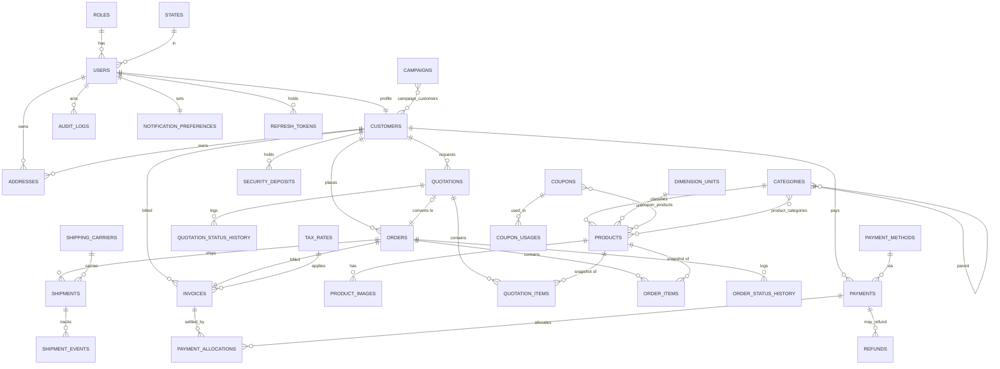

# Zolo Packaging — Database Audit & Redesign

> **SUPERSEDED (2026-08-20).** This document captures the *pre-migration* MongoDB
> state and the redesign plan. That migration has since been completed: the
> application now runs on **PostgreSQL 16 + Prisma**. This file is retained for
> historical context on why the schema looks the way it does. For the current
> database, see [`DATABASE.md`](../DATABASE.md) and `server/prisma/schema.prisma`.

> **Status:** Design + migration plan only. **No collections have been created, altered, renamed or dropped.** Every recommendation below is gated behind the dependency checks and reversible migrations described in §11–§12.

---

## 0. Executive summary

The existing database is **MongoDB (Mongoose 8)** — *not* SQL. The audit therefore speaks in **collections / documents / references**, and adapts the SQL-flavoured brief (foreign keys → refs, CHECK → enum+validators, junction tables → ref arrays or link collections, `DECIMAL` money → **integer minor units (paise)**).

**Central finding:** the frontend (admin ERP + buyer dashboard, both built out) is *far* ahead of the backend schema. The current DB has **12 collections** built for a simple B2C storefront (cart, wishlist, reviews, promotions, support). The current application needs **first-class Customers, Quotations/RFQ, Invoices, richer Orders (snapshotted items + normalized status history), Shipments, Payments with allocation, Audit Logs and Settings** — most of which **have no model at all today**.

Two models — **`Payment` and `Shipping`** — are defined but **wired to no controller or route** (orphaned). The storefront collections (**Cart, Wishlist, Review, Return, Support**) are real and referenced by controllers, but sit *outside* the redesign's admin/buyer module scope; they are **KEEP-as-storefront**, not deleted.

| Bucket | Count |
|---|---|
| Master / reference collections | 6 |
| Transaction (core business) collections | 11 |
| Junction / link collections | 3 |
| Child (1:N) / ledger collections | 8 |
| History / audit collections | 4 |
| System collections | 5 |
| Storefront (retained, out-of-redesign-scope) | 5 |
| **Total collections (target)** | **42** |

*(Full breakdown in §11. A leaner first build lands the core ~34 by deferring the Marketing sub-collections and single-category products — see §11 note.)*

---

## 1. What exists today (ground truth)

Read from `backend/models/*.js`, `backend/controllers/*`, `backend/routes/*`, `backend/seed.js`, `backend/config/db.js`.

| Collection | Key fields (as-is) | Wired to controller/route? | Seeded? |
|---|---|---|---|
| **User** | name, email(unique), password(bcrypt pre-save), role`['user','admin']`, addresses[] (embedded), resetPasswordToken/Expire | ✅ auth, user, admin | ✅ |
| **Category** | id(slug), name, slug(unique), icon, count, subcategories[] (embedded) | ✅ product | ✅ |
| **Product** | name, slug(unique), category(slug str), moq, unit, image, emoji, description, sizes[], materials[], rating, reviews, inStock, stockCount, tags[], flags; `text` index on name+description | ✅ product | ✅ |
| **Order** | userId→User, items[] (embedded snapshot: name/image/price/color/size/material/qty), shippingAddress (embedded), totalAmount, paymentStatus`['Pending','Completed','Failed']`, orderStatus (8 enum), trackingHistory[] (embedded) | ✅ order, admin | ❌ |
| **Payment** | orderId→Order(idx), amount, method, status(3), transactionId | ❌ **orphaned** | ❌ |
| **Shipping** | orderId→Order(idx), carrier, trackingNumber, status(6), estimatedDelivery | ❌ **orphaned** | ❌ |
| **Cart** | userId→User(unique), lines[] (embedded) | ✅ cart | ❌ |
| **Wishlist** | userId→User(unique), products[]→Product | ✅ wishlist | ❌ |
| **Review** | productId→Product, userId→User, rating(1–5), comment; unique(productId,userId) | ✅ review | ✅ |
| **Return** | orderId→Order, userId→User, items[], status(4) | ✅ return | ❌ |
| **Promotion** | code(unique,upper), discountType`['percent','flat']`, discountAmount, validFrom/Until, usageLimit, usedCount; **TTL index auto-deletes on validUntil** | ✅ promotion | ✅ |
| **Support** | userId→User, subject, message, status`['Open','Closed']`, replies[] | ✅ support | ✅ |

### Problems identified
1. **No Customer entity.** Buyer identity, company, GSTIN, customer code, billing/shipping profiles all live nowhere. The buyer dashboard scopes by `customerId` — unrepresented in the DB.
2. **No Quotation/RFQ, Invoice, Audit, or Settings collections** — all four are core to the current app.
3. **`Product` is storefront-shaped**, missing the admin catalog fields the UI already uses: SKU, dimensions (L/W/H + unit), GSM, color, price (money), lowStockLevel, productStatus (draft/active/archived), archive/soft-delete, image gallery + primary. `category` is a loose slug string, not a ref.
4. **`Order` conflates concerns:** money is a single `totalAmount` float (no subtotal/discount/tax/shipping breakdown, no eco points, no paid/balance); tracking is an embedded array with an **8-value enum that doesn't match** the app's manufacturing/buyer flow; order items snapshot *some* fields but not SKU/specs/unit-price/discount/tax/line-total.
5. **Money stored as `Number` (float).** Financial amounts must never be float.
6. **`Payment`/`Shipping` orphaned** — schemas exist but no code path creates or reads them.
7. **`Promotion` TTL index deletes history.** `expireAfterSeconds:0` on `validUntil` **destroys expired coupons** — violates "never delete historical business records" and breaks coupon-usage reporting.
8. **Embedded addresses on `User`** duplicate what a normalized `addresses` collection + customer profile should own.
9. **No status-history normalization** for quotations, payments, or shipments (only orders have an embedded one, and it's the wrong enum).

---

## 2. Feature → data mapping (current app)

| Module (Admin / Buyer) | Backing collections (target) |
|---|---|
| Auth (admin+buyer, roles) | `users`, `roles`, `refresh_tokens`, `password_reset_tokens`, `email_verification_tokens` |
| Customers (admin) / Account (buyer) | `customers`, `addresses` |
| Product Catalog (admin) | `categories`, `products`, `product_images`, `product_categories` (M:N, only if needed) |
| Quotations / RFQ (both) | `quotations`, `quotation_items`, `quotation_status_history` |
| Orders + Tracking (both) | `orders`, `order_items`, `order_status_history`, `order_addresses` (embedded snapshot) |
| Shipping / Tracking (both) | `shipments`, `shipment_events` |
| Finance / Payment History (both) | `invoices`, `payments`, `payment_allocations`, `refunds`, `security_deposits` |
| Marketing (admin) | `coupons`, `coupon_usages`, `campaigns`, `campaign_customers` |
| Audit Logs (admin) | `audit_logs` |
| Settings (both) | `application_settings`, `notification_preferences` |
| Reports (both) | *no new tables* — read-side aggregation over the above |
| Storefront (existing, retained) | `carts`, `wishlists`, `reviews`, `returns`, `support_tickets` |

---

## 3. Audit classification (KEEP / MODIFY / MERGE / DEPRECATE / REMOVE)

| Collection | Verdict | Why |
|---|---|---|
| **User** | **MODIFY** | Split identity from buyer profile. Add `fullName, phone(unique sparse), status, emailVerified, phoneVerified`, `role` ref (or keep enum but add `'buyer'` alias). **Move embedded `addresses[]` out** to `addresses` collection. Keep bcrypt hashing. |
| **Category** | **MODIFY** | Keep as master. Add `parentId` (self-ref) to model subcategories as rows instead of embedded, add `status` + `deletedAt` (soft archive), keep slug unique. Recompute `count` as a derived/denormalized cache, not source of truth. |
| **Product** | **MODIFY** | Extend to the admin catalog shape: `sku(unique), dimensions{l,w,h,unit}, gsm, color, priceMinor(int), moq, stockQty, lowStockLevel, productStatus['draft','active','archived'], primaryImage`, soft-delete via `productStatus='archived'` + `deletedAt`. `category` → `categoryId` ref. Move images to `product_images`. Keep `text` index. Stock **status is derived** (in/low/out), not stored. |
| **Order** | **MODIFY (major)** | Keep the collection + `userId`. Add `customerId` ref, `orderNumber(unique)`, full money breakdown (`subtotalMinor, discountMinor, ecoPoints, shippingMinor, taxMinor, grandTotalMinor, paidMinor`), `paymentStatus` (5-enum), `trackingStage`. **Move `items[]` → `order_items`** with full commercial snapshot. **Move `trackingHistory[]` → `order_status_history`** with the correct 9-stage enum. Keep `shippingAddress` as an embedded snapshot (correct — addresses must freeze). |
| **Payment** | **MODIFY + WIRE** | Currently orphaned. Repurpose into the finance model: link to `invoiceId`+`orderId`+`customerId`, `amountMinor(int)`, `method` (ref to master), `status`(5-enum), `reference`, `paidAt`. Add allocations. Wire a controller/route. |
| **Shipping** | **MERGE → `shipments`** | Rename/rework the orphaned `Shipping` into `shipments` with `awb, courier(ref), dispatchedAt, expectedAt, deliveredAt, status`, plus a new `shipment_events` history child. Wire a controller/route. |
| **Promotion** | **MODIFY → `coupons`** | **Remove the destructive TTL index** (it deletes history). Rename to `coupons`, add `status['active','scheduled','expired']` (derived or set), keep `code` unique, add `coupon_usages` link + optional `coupon_products`/`coupon_categories` targeting. |
| **Cart** | **KEEP** | Storefront feature, actively used. Out of admin/buyer redesign scope but valid. No change. |
| **Wishlist** | **KEEP** | Same — active storefront feature. |
| **Review** | **KEEP** | Active; good unique(productId,userId) constraint. No change. |
| **Return** | **KEEP (rename optional)** | Active. Buyer "Recycle" is a *separate* concept (packaging pickup) — do **not** conflate. Returns stay as product returns. Consider a future `recycle_pickups` if Recycle graduates from mock. |
| **Support** | **KEEP → `support_tickets`** | Active buyer support. Optional rename for clarity. |
| *(none exists)* **Customer** | **CREATE** | No customer entity today; required by every admin+buyer flow. |
| *(none)* **Quotation / RFQ** | **CREATE** | Core module, no model today. |
| *(none)* **Invoice** | **CREATE** | Finance + buyer payment history need it. |
| *(none)* **Audit log** | **CREATE** | Admin Audit Logs module, no model today. |
| *(none)* **Settings** | **CREATE** | Admin+buyer settings, no model today. |

> **Nothing is classified REMOVE.** The only deletion-adjacent action is **removing the `Promotion` TTL index** (a bug that destroys data) as part of the `coupons` migration — additive-safe and reversible.

---

## 4. Final schema — collections

Conventions: `_id` ObjectId PK everywhere; money as **`*Minor` integers (paise)**; timestamps `createdAt/updatedAt`; actor `createdBy/updatedBy` (User ref) on mutable business records; `deletedAt` **only** where soft-delete is real. Enums use Mongoose `enum` (+ Joi at the API edge) as the CHECK-constraint equivalent.

### 4.1 Master / reference (6)
```
roles(_id, key['admin','buyer'], label, permissions[])           unique(key)
states(_id, code, name)                                          unique(code)   // India states/UTs
dimension_units(_id, code['in','cm','mm'], label)                unique(code)
payment_methods(_id, code['upi','neft','card','cheque','cash'], label)  unique(code)
shipping_carriers(_id, code, name, trackingUrlTemplate)          unique(code)
tax_rates(_id, code['GST18',…], ratePctBasisPoints:int, label)   unique(code)   // 1800 = 18.00%
```
*Status vocabularies (quotation/order/payment/shipping statuses) are **enums**, not master collections — they are code-controlled, low-cardinality, and never user-edited. Promoting them to tables adds joins with no payoff.*

### 4.2 Transaction / core (11)
```
users(_id, fullName, email!uniq, phone?uniqSparse, passwordHash, roleId→roles,
      stateId?→states, status['active','suspended'], emailVerified, phoneVerified,
      createdAt, updatedAt)
customers(_id, userId→users(1:1), customerCode!uniq, company, gstin?,
          segment['small_seller','d2c_brand','enterprise'], status['active','archived'],
          lifetimeValueMinor, deletedAt?)                         idx(userId), uniq(customerCode)
addresses(_id, ownerType['user','customer'], ownerId, kind['billing','shipping'],
          name, phone, line1, line2?, city, stateId→states, zip, country='India',
          isDefault)                                              idx(ownerType,ownerId,kind)
categories(_id, name, slug!uniq, parentId?→categories, icon, status, deletedAt?)
products(_id, sku!uniq, name, slug!uniq, categoryId→categories, description,
         dimensions{lengthMm,widthMm,heightMm,unitId→dimension_units}, gsm?, color?,
         priceMinor:int, moq, stockQty, lowStockLevel, productStatus['draft','active','archived'],
         primaryImageId?→product_images, deletedAt?)              text(name,description)
quotations(_id, quotationNumber!uniq, customerId→customers, status['pending','quoted','won','lost','cancelled'],
           validUntil?, currency='INR', subtotalMinor, taxMinor, grandTotalMinor,
           convertedOrderId?→orders, createdBy, deletedAt?)
orders(_id, orderNumber!uniq, customerId→customers, userId→users, type['ready_made','custom'],
       paymentStatus['pending','partial','paid','failed','refunded'],
       trackingStage['confirmed','processing','production','quality_check','packed',
                     'dispatched','in_transit','delivered','cancelled'],
       subtotalMinor, discountMinor, ecoPoints, shippingMinor, taxMinor, grandTotalMinor,
       paidMinor, placedAt, dueAt, expectedDeliveryAt?, createdBy)
invoices(_id, invoiceNumber!uniq, orderId→orders, customerId→customers,
         status['draft','sent','paid','partial','overdue'], amountMinor, taxMinor,
         paidMinor, issuedAt, dueAt)
payments(_id, paymentNumber!uniq, customerId→customers, orderId?→orders, invoiceId?→invoices,
         methodId→payment_methods, amountMinor, status['pending','partial','paid','failed','refunded'],
         reference, paidAt)
shipments(_id, shipmentNumber!uniq, orderId→orders, carrierId→shipping_carriers, awb?,
          cartons, weightGrams, destination, status['packing','awb_booked','picked_up',
          'in_transit','out_for_delivery','delivered','cancelled'],
          dispatchedAt?, expectedAt?, deliveredAt?)
coupons(_id, code!uniqUpper, discountType['percent','flat'], discountValue,
        status['active','scheduled','expired'], validFrom, validUntil, usageLimit,
        usedCount, deletedAt?)     // NO TTL index
```

### 4.3 Junction / link (3 — only true M:N)
```
product_categories(_id, productId→products, categoryId→categories)   uniq(productId,categoryId)  // only if a product may sit in >1 category; otherwise skip
coupon_products(_id, couponId→coupons, productId→products)           uniq(couponId,productId)
campaign_customers(_id, campaignId→campaigns, customerId→customers)  uniq(campaignId,customerId)
```
> `order_items`, `quotation_items`, `product_images`, `payment_allocations` are **1:N children, not junctions** — they get their own collections but are not M:N.

### 4.4 Line-item / child collections (1:N)
```
order_items(_id, orderId→orders, productId?→products,
            // SNAPSHOT — frozen at order time, immune to later product edits:
            productName, sku, specs{dimensions,gsm,material,printing,finishes[]},
            quantity, unitPriceMinor, discountMinor, taxMinor, lineTotalMinor)   idx(orderId)
quotation_items(_id, quotationId→quotations, productId?→products, productName, sku?,
                specs{…}, quantity, unitPriceMinor, lineTotalMinor)              idx(quotationId)
product_images(_id, productId→products, url|emoji, position, isPrimary)          idx(productId)
payment_allocations(_id, paymentId→payments, invoiceId→invoices, amountMinor)    idx(paymentId)
security_deposits(_id, customerId→customers, orderId?→orders, amountMinor,
                  status['held','refunded','forfeited'], heldAt, releasedAt?)    idx(customerId)
refunds(_id, refundNumber!uniq, paymentId→payments, orderId→orders, amountMinor,
        reason, status['requested','approved','processed','rejected'], processedAt?)
```
> **`security_deposits` is modelled separately** (a held-balance transaction), never as a payment *status* — satisfying the brief explicitly.

### 4.5 History / audit (4)
```
order_status_history(_id, orderId→orders, stage(enum ↑), note?, updatedBy→users, at)  idx(orderId,at)
quotation_status_history(_id, quotationId→quotations, status(enum), note?, updatedBy, at)  idx(quotationId,at)
shipment_events(_id, shipmentId→shipments, status(enum), location?, note?, at)        idx(shipmentId,at)
audit_logs(_id, userId→users, module, entityType, entityId, action['create','update',
           'delete','status_change'], oldValues{}, newValues{}, ip?, at)             idx(entityType,entityId,at)
```

### 4.6 System (3)
```
application_settings(_id, scope['company','tax','payment','shipping','email','whatsapp','theme','api'],
                     key, value(Mixed), updatedBy)               uniq(scope,key)
notification_preferences(_id, userId→users(1:1), orderUpdates, quotationReplies,
                         promotions, recycleReminders)           uniq(userId)
refresh_tokens(_id, userId→users, tokenHash, expiresAt, revokedAt?)   idx(userId), TTL(expiresAt)
password_reset_tokens(_id, userId→users, tokenHash, expiresAt, usedAt?)   TTL(expiresAt)
email_verification_tokens(_id, userId→users, tokenHash, expiresAt, usedAt?)  TTL(expiresAt)
```
> TTL indexes here are **correct** (ephemeral security tokens *should* expire) — unlike the `Promotion` TTL, which wrongly deleted business history.

### 4.7 Storefront (retained, out-of-scope for redesign) (5)
`carts`, `wishlists`, `reviews`, `returns`, `support_tickets` — unchanged, still valid, still wired.

---

## 5. Relationships

```
users 1─1 customers                 users 1─N addresses (ownerType='user')
customers 1─N addresses             customers 1─N quotations
customers 1─N orders                customers 1─N payments
customers 1─N invoices              customers 1─N security_deposits
roles 1─N users                     states 1─N users / addresses
categories 1─N products (self-ref parent for subcats)
products 1─N product_images         products N─M categories (via product_categories, optional)
quotations 1─N quotation_items      quotations 1─N quotation_status_history
quotations 1─1 orders (conversion, nullable)
orders 1─N order_items              orders 1─N order_status_history
orders 1─N shipments                shipments 1─N shipment_events
orders 1─1 invoices                 invoices 1─N payments (via payment_allocations, N─M capable)
payments 1─N refunds
coupons 1─N coupon_usages           coupons N─M products/categories (targeting)
campaigns N─M customers             users 1─N audit_logs
```

Canonical business flow (matches the brief):
`AUTH → CUSTOMER → QUOTATION → (convert) → ORDER → INVOICE → PAYMENT → SHIPMENT → TRACKING(events) → REPORTING`, with Catalog, Marketing, Audit, Settings supporting.

---

## 6. Index strategy (driven by real queries)

| Collection | Index | Serves |
|---|---|---|
| users | `email` uniq; `phone` uniq sparse; `roleId` | login by email/phone, role filters |
| customers | `customerCode` uniq; `userId` uniq; `status` | buyer scoping, admin list |
| addresses | `(ownerType, ownerId, kind)` | address lookup |
| products | `sku` uniq; `slug` uniq; `categoryId`; `productStatus`; `text(name,description)`; `(categoryId, productStatus)` | catalog search + filter |
| quotations | `quotationNumber` uniq; `customerId`; `status`; `(customerId, status)` | buyer + admin RFQ lists |
| orders | `orderNumber` uniq; `customerId`; `trackingStage`; `paymentStatus`; `createdAt`; `(customerId, createdAt)` | dashboards, buyer scoping, pipelines |
| order_items | `orderId` | detail load |
| order_status_history | `(orderId, at)` | tracking bar |
| invoices | `invoiceNumber` uniq; `orderId`; `customerId`; `status` | finance |
| payments | `paymentNumber` uniq; `orderId`; `invoiceId`; `status`; `(customerId, paidAt)` | payment history |
| shipments | `shipmentNumber` uniq; `orderId`; `awb` sparse; `status` | tracking |
| shipment_events | `(shipmentId, at)` | tracking history |
| coupons | `code` uniq; `status` | marketing |
| audit_logs | `(entityType, entityId, at)`; `(userId, at)`; `module` | audit trail |
| refresh/reset/verify tokens | TTL on `expiresAt`; `userId` | auth |

> No index is added speculatively; each maps to a filter/sort the admin or buyer UI actually issues.

---

## 7. Data-integrity rules

- **Money:** every amount is an **integer minor unit** (`*Minor`, paise). No floats. Convert at the presentation edge only.
- **Enums** enforce the CHECK-constraint role (status vocabularies), validated again by **Joi** at the API boundary (already the project's pattern in `validations/`).
- **Uniqueness:** `email`, `phone`(sparse), `customerCode`, `sku`, `slug`, all `*Number` business identifiers, `coupons.code`, and every junction's composite pair.
- **Referential behaviour (explicit, non-cascading on history):**
  - Deleting a `product` is **forbidden** → soft-archive (`productStatus='archived'` + `deletedAt`). `order_items`/`quotation_items` keep their **snapshot**, so historical orders are immune to catalog edits.
  - `orders`, `invoices`, `payments`, `shipments`, `*_status_history`, `audit_logs` are **never cascade-deleted**. Customer "deletion" is a soft archive; their financial/order history persists.
  - Cascades allowed only for **ephemeral children**: tokens (TTL), a cart's lines.
- **Snapshots:** `order_items` and `quotation_items` freeze `productName, sku, specs, unitPrice, discount, tax, lineTotal`; `orders.shippingAddress` is an embedded frozen copy. Product/price changes never rewrite history.
- **Soft-delete** (`deletedAt`) only on: `products, categories, customers, quotations, coupons`. Not on tokens, line items, history, or ledgers.

---

## 8. Mermaid ERD



---

## 9. Migration plan (reversible, non-destructive)

> MongoDB is schemaless per-document, so "migrations" = **create indexes, add new collections, and backfill/transform documents** via versioned scripts (`backend/migrations/NNN_*.js`), each exporting `up()` and `down()`. Nothing is dropped until §11 dependency checks pass.

**Phase A — additive (zero risk).** Create the *new* collections with no existing analogue: `customers, addresses, quotations, quotation_items, quotation_status_history, invoices, payment_allocations, security_deposits, refunds, audit_logs, application_settings, notification_preferences, campaigns, campaign_customers, coupon_usages, product_images, order_items, order_status_history, shipment_events` + master collections + token collections. Create all indexes. **Down:** drop the newly-created collections (they hold no legacy data yet).

**Phase B — backfill from existing data.**
1. For each `User` with `role∈{user}` → create a `customers` doc (`customerCode` generated), copy company/GSTIN if present (else null), 1:1 link.
2. Explode each `User.addresses[]` → `addresses` docs (`ownerType='user'`).
3. Explode each `Order.items[]` → `order_items` (map old fields onto the snapshot; specs best-effort from color/size/material).
4. Explode each `Order.trackingHistory[]` → `order_status_history`, mapping the **old 8-enum → new 9-stage enum** (`Pending→confirmed, Confirmed→confirmed, Processing→processing, Packed→packed, Shipped→dispatched, Out for Delivery→in_transit, Delivered→delivered, Cancelled→cancelled`).
5. Convert every money `Number` → `*Minor` integer (`Math.round(x*100)`), writing new fields alongside the old (keep old until Phase D).
6. `Promotion` → `coupons` (copy; set `status` from dates). **Do not copy the TTL index.**
7. `Shipping` (if any docs) → `shipments` + seed one `shipment_events` from its status.
**Down:** delete only the docs created by this backfill (tagged with a `_migratedFrom` marker for clean rollback).

**Phase C — index correction.** **Drop the `Promotion.validUntil` TTL index** (the data-destroying bug). Re-create `coupons` without it. **Down:** recreate the old index (only if truly needed — flagged as not recommended).

**Phase D — deprecate old shapes (only after §11).** Once controllers read the new collections: stop writing `Order.items[]`/`trackingHistory[]`/`totalAmount` float and the embedded `User.addresses[]`; leave the legacy fields in place (read-only) for one release, then remove in a later, separately-reviewed migration. **Down:** resume writing legacy fields.

Rollback strategy: every script is `up/down`; Phase A/B are fully reversible; Phase C keeps a documented recreate; Phase D is deferred and independently gated. **A full `mongodump` backup is required before Phase B and Phase C.**

---

## 10. Removal / deprecation — dependency checklist

**No collection is slated for removal.** The only *removal* is the **`Promotion` TTL index** (a bug). Before it (or any future table removal) ships, verify — per the brief:
1. app references (grep controllers/routes/models/frontend) ✔ done for TTL: no code depends on auto-expiry
2. foreign keys / refs ✔ none point at expired-coupon auto-deletion
3. migrations ✔ index defined only in the model
4. ORM models ✔ single definition in `Promotion.js`
5. APIs ✔ `promotionController` reads by code/date, not by expecting deletion
6. reports ✔ coupon-usage reporting *needs* expired rows kept
7. historical data ✔ removing the TTL **preserves** history (the goal)
8. other modules ✔ Marketing is the only consumer

---

## 11. Final counts

| Category | Collections | Count |
|---|---|---|
| **Master / reference** | roles, states, dimension_units, payment_methods, shipping_carriers, tax_rates | **6** |
| **Transaction (core)** | users, customers, addresses, categories, products, quotations, orders, invoices, payments, shipments, coupons | **11** |
| **Junction / link** | product_categories, coupon_products, campaign_customers | **3** |
| **Child (1:N) / ledger** | order_items, quotation_items, product_images, payment_allocations, security_deposits, refunds, coupon_usages, campaigns | **8** |
| **History / audit** | order_status_history, quotation_status_history, shipment_events, audit_logs | **4** |
| **System** | application_settings, notification_preferences, refresh_tokens, password_reset_tokens, email_verification_tokens | **5** |
| **Storefront (retained)** | carts, wishlists, reviews, returns, support_tickets | **5** |
| **TOTAL** | | **42** |

*(A leaner build can drop `product_categories` if products stay single-category, and fold `campaigns`/`coupon_products`/`campaign_customers` to a later Marketing phase — bringing the core to ~34.)*

---

## 12. What to build next (execution order)

1. **Phase A migration** — new collections + indexes (safe, additive).
2. New **Mongoose models** matching §4; wire the orphaned Payment/Shipping into real controllers.
3. **Phase B backfill** (after `mongodump`).
4. Point controllers/APIs at the new collections; add `quotation`, `invoice`, `audit`, `settings`, `customer` controllers/routes (currently missing).
5. **Phase C** index fix.
6. Update `seed.js` to seed the new master + demo transaction data.
7. Run build/tests; verify buyer scoping (`customerId`) and admin aggregates against the new shape.
8. **Phase D** deprecation — only after the new paths are proven in a release.
```
